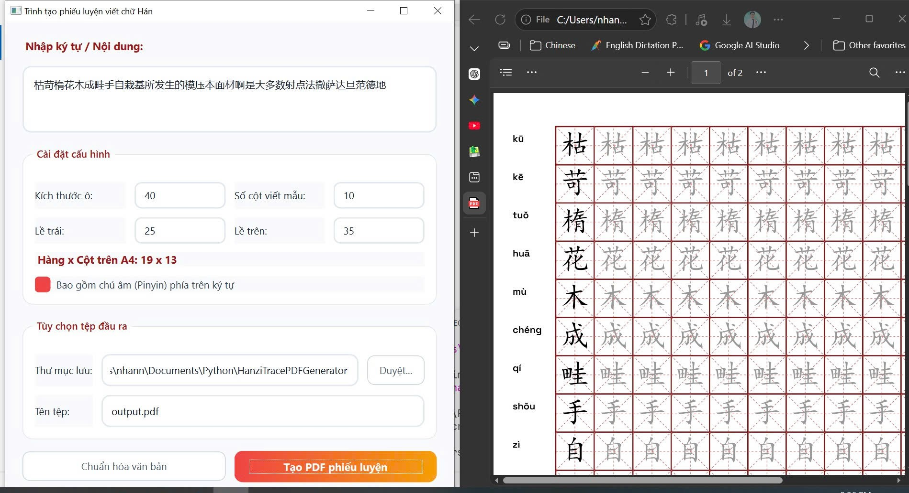

# Trình Tạo Phiếu Luyện Viết Chữ Hán

Ứng dụng tạo phiếu luyện viết chữ Hán tự động từ văn bản tiếng Trung, xuất ra file PDF với lưới ô Mi Tự (米字格).

<!-- Screenshot -->

## 📥 Cài Đặt & Tải Về

### Bước 1: Tải Về Ứng Dụng
1. Truy cập trang [Releases](https://github.com/khanhnhanbk/HanziTracePDFGenerator/releases/tag/Beta) của dự án
2. Tìm phiên bản mới nhất (thường có tên như `HanziTracer.zip`)
3. Nhấn vào file `.zip` để tải về máy tính

### Bước 2: Giải Nén
1. Tìm file `HanziTracer.zip` vừa tải về (thường ở thư mục **Downloads**)
2. Nhấp chuột phải vào file → chọn **"Extract All..."** (hoặc **"Giải nén tại đây"**)
3. Chọn vị trí muốn giải nén (ví dụ: Desktop, Documents)
4. Chờ quá trình giải nén hoàn tất

### Bước 3: Chạy Ứng Dụng
1. Mở thư mục vừa giải nén
2. Tìm file `HanziTracer.exe` 
3. Nhấp đúp chuột vào `HanziTracer.exe` để khởi động ứng dụng

> ⚠️ **Lưu ý:** Lần đầu chạy có thể mất vài giây để tải các tài nguyên. Đây là hoạt động bình thường.

---

## 🎯 Cách Sử Dụng

### Giao Diện Chính

| Phần | Mô Tả |
|------|-------|
| **Nhập ký tự / Nội dung** | Dán hoặc nhập các chữ Hán cần luyện viết |
| **Cài đặt cấu hình** | Điều chỉnh kích thước ô, lề, cột viết mẫu |
| **Hàng x Cột trên A4** | Hiển thị tự động số hàng/cột phù hợp với cài đặt |
| **Tùy chọn tệp đầu ra** | Chọn nơi lưu file PDF và đặt tên |
| **Chuẩn hóa văn bản** | Loại bỏ dấu câu, khoảng trắng, chữ trùng lặp |
| **Tạo PDF phiếu luyện** | Tạo file PDF luyện viết |

### Hướng Dẫn Chi Tiết

#### 1. Nhập Văn Bản
- Sao chép văn bản tiếng Trung muốn luyện viết
- Dán vào ô **"Nhập ký tự / Nội dung"**
- Hoặc nhập thủ công trực tiếp

#### 2. Chuẩn Hóa Văn Bản (Tuỳ Chọn)
- Nhấn nút **"Chuẩn hóa văn bản"** để:
  - ✓ Xóa tất cả dấu câu (chấm, phẩy, hỏi, chém, ...)
  - ✓ Xóa khoảng trắng
  - ✓ Giữ lại chỉ các chữ Hán duy nhất (không trùng lặp)
  - ✓ Hỗ trợ **từ ghép** khi bật chế độ **Từ ghép** để giữ nguyên các cụm từ và tách nội dung theo dấu phân cách

#### 3. Điều Chỉnh Cài Đặt

**Kích Thước Ô:**
- Giá trị: 1-200 (pixel)
- Mặc định: 45
- Lớn hơn = ô to hơn, ít chữ trên 1 trang
- Nhỏ hơn = ô nhỏ hơn, nhiều chữ trên 1 trang

**Số Cột Viết Mẫu:**
- Giá trị: 1-50
- Mặc định: 10
- Cột đầu: chữ đen (chữ gốc)
- Các cột sau: chữ xám (viết mẫu để luyện)

**Lề Trái / Lề Trên:**
- Giá trị: 0-100 (pixel)
- Mặc định: 25/35
- Điều chỉnh khoảng cách từ mép giấy đến lưới

**Bao Gồm Chú Âm (Pinyin):**
- ✓ Bật: Hiển thị phiên âm trên mỗi chữ
- ☐ Tắt: Chỉ hiển thị lưới ô

**Hàng x Cột trên A4:**
- Tự động cập nhật khi bạn thay đổi kích thước ô, lề trái, lề trên
- Cho biết bao nhiêu chữ có thể vào 1 trang A4

#### 4. Chọn Thư Mục Lưu
- Nhấn nút **"Duyệt..."**
- Chọn nơi muốn lưu file PDF (ví dụ: Desktop, Documents)
- Hoặc để trống = lưu vào thư mục hiện tại

#### 5. Đặt Tên File
- Nhập tên file muốn lưu (ví dụ: `luyện_chữ_hán.pdf`)
- Đuôi `.pdf` tự động thêm vào nếu quên

#### 6. Tạo PDF
- Nhấn nút **"Tạo PDF phiếu luyện"** (nút màu đỏ)
- Chờ cho đến khi thấy thông báo **"Hoàn tất"**
- File PDF sẽ được lưu tại đường dẫn bạn chọn

---

## 📋 Ví Dụ Sử Dụng

### Ví Dụ 1: Tạo Phiếu Luyện Chữ Cơ Bản
1. Nhập: `你好世界`
2. Cài đặt:
   - Kích thước ô: 45
   - Số cột viết mẫu: 10
   - Bao gồm Pinyin: ✓
3. Chọn thư mục Desktop
4. Tên file: `pho_tho_co_ban`
5. Nhấn **"Tạo PDF phiếu luyện"**
6. → File `pho_tho_co_ban.pdf` lưu tại Desktop

### Ví Dụ 2: Tạo Phiếu Với Ô Lớn Hơn
1. Dán text dài
2. Cài đặt:
   - Kích thước ô: 80 (ô to hơn)
   - Số cột viết mẫu: 5 (ít cột hơn)
   - Lề trái/trên: 30 (rộng hơn)
3. Xem "Hàng x Cột trên A4" = ít hơn chữ trên mỗi trang
4. Tạo PDF

---

## ⚙️ Tính Năng

✅ **Tự Động Chuẩn Hóa:** Xóa dấu câu, khoảng trắng, chữ trùng
✅ **Từ Ghép:** Giữ nguyên cụm từ khi chế độ **Từ ghép** được bật
✅ **Hiển Thị Pinyin:** Dễ dàng biết cách phát âm chữ Hán
✅ **Lưới Mi Tự:** Chuẩn bố cục truyền thống Trung Quốc
✅ **Tùy Chỉnh Linh Hoạt:** Điều chỉnh kích thước, lề, số cột
✅ **Tính Toán Tự Động:** Hiển thị hàng/cột trước khi tạo
✅ **Hỗ Trợ Tiếng Việt:** Giao diện và hướng dẫn 100% tiếng Việt

---

## 🐛 Gặp Lỗi?

### Lỗi: "Không Thể Mở File Fonts"
- **Giải pháp:** Đảm bảo thư mục `statics/fonts/` tồn tại trong folder ứng dụng
- Tải lại bản mới nhất từ Releases

### Lỗi: "Tạo PDF Thất Bại"
- **Kiểm tra:**
  - Có nhập chữ Hán vào khung "Nhập ký tự"?
  - Thư mục lưu có tồn tại và có quyền ghi?
  - Tên file không chứa ký tự không hợp lệ?

### Ứng Dụng Chạy Chậm
- **Lần đầu:** Bình thường, chờ tải xong
- **Lần sau:** Nên nhanh hơn

---

## 📞 Hỗ Trợ

Nếu gặp vấn đề:
1. Kiểm tra lại các bước trên
2. Thử tải lại phiên bản mới nhất
3. Liên hệ tác giả hoặc mở Issue trên GitHub

---

## 📄 Yêu Cầu Hệ Thống

- **OS:** Windows 7 trở lên
- **RAM:** Tối thiểu 256MB
- **Dung Lượng:** ~200MB (bao gồm thư viện Python)
- **Không cần cài Python:** Ứng dụng được đóng gói sẵn

---

**Phiên Bản:** v1.1  
**Ngôn Ngữ:** Tiếng Việt  
**Định Dạng Xuất:** PDF (A4)  
